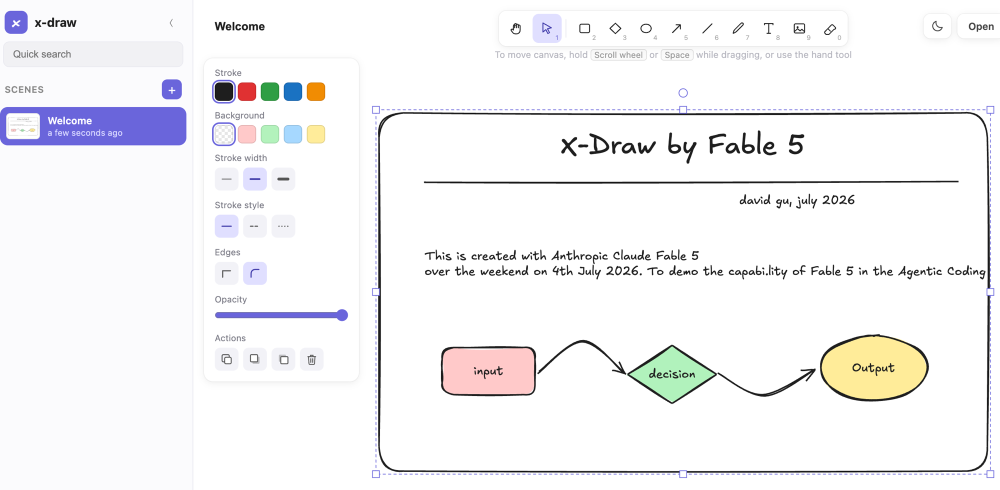

# x-draw

A lightweight, local-first whiteboard — built around a daily
note-taking and brainstorming workflow: hand-drawn diagrams, pastel boxes connected by
arrows, lots of handwritten-style text notes, and many named scenes.

No build step, no backend, no account. Everything lives in your browser's localStorage.

**▶ Try it live: [david0806sg.github.io/x-draw](https://david0806sg.github.io/x-draw/)**



## Run it

```bash
cd x-draw
python3 -m http.server 8642
# open http://localhost:8642
```

Any static file server works (`npx serve`, nginx, ...). Opening `index.html` directly via
`file://` also works in most browsers.

## Features

- **Infinite canvas** — pan with space+drag, scroll wheel, or the hand tool; zoom with
  Ctrl/Cmd+wheel (pinch on trackpad) or the − / % / + control.
- **Hand-drawn shapes** via [rough.js](https://roughjs.com): rectangle (rounded or sharp),
  diamond, ellipse, line, arrow, freehand pen.
- **Arrow-to-shape binding** — draw an arrow from/to a shape (or text/image) and it snaps to
  the border and stays attached when the shape moves or resizes. Drag a selected arrow's
  endpoint (round handles) to re-route or re-bind; drag the arrow body to detach it.
- **Curved & multi-point lines/arrows** — drag to draw a quick straight arrow, or *click*
  point-by-point to place a multi-point one (double-click, Enter, or Esc to finish). On a
  selected line/arrow, drag any point handle to reshape it, drag a segment's midpoint
  handle to add a bend, and drop a point back in line with its neighbours to remove it.
  The Edges property switches between smooth curves (round) and elbow segments (sharp).
- **Text notes** in the x-draw handwriting font, vendored locally —
  click with the text tool or double-click anywhere; multi-line, four sizes (S/M/L/XL).
- **Shape labels** — double-click a rectangle/diamond/ellipse (or click it with the text tool)
  to type a label that stays centered and follows the shape through move, resize, rotate,
  duplicate, and delete. Clicking a label selects its container; double-click edits the text.
  Labels **auto-wrap** to the shape's width (re-wrapping live as you resize), lines are
  center-aligned, and your original text is preserved — re-editing shows it unwrapped.
- **Rotation** — every shape, text, and image has a round rotate handle above its selection
  box; hold Shift to snap to 15° steps. Resizing a rotated element keeps the opposite
  corner anchored, and hit-testing/labels follow the rotation.
- **Styling panel** — stroke color, pastel background fills, hachure/cross-hatch/solid fill,
  stroke width & style (solid/dashed/dotted), edges, opacity.
- **Select / move / resize / multi-select** (rubber band or shift-click), duplicate,
  bring-to-front / send-to-back, eraser.
- **Images** — insert from file (tool 9) or just paste from clipboard; pasted plain text
  becomes a text note.
- **Scenes sidebar** — unlimited named scenes with thumbnails, relative timestamps, quick
  search, rename (edit title top-left), delete. Autosaved to localStorage.
- **Undo / redo** (Ctrl+Z / Ctrl+Shift+Z), up to 100 steps.
- **Export PNG** (2x, auto-cropped to content) and **Save/Open** `.xdraw` JSON files
  (plain `{elements: [...]}` open format). Exports are always
  light-mode, matching how the data is stored.
- **Dark mode** — sun/moon toggle in the top-right; follows your system preference on
  first launch and remembers your choice. Drawings keep their stored
  colors and the canvas is inverted with a filter, so black ink turns white and pastel
  fills turn into dark tones automatically.

## Keyboard shortcuts

| Key | Tool / action |
| --- | --- |
| `1` / `V` | Select |
| `2` / `R` | Rectangle |
| `3` / `D` | Diamond |
| `4` / `O` | Ellipse |
| `5` / `A` | Arrow |
| `6` / `L` | Line |
| `7` / `P` | Freehand draw |
| `8` / `T` | Text |
| `9` | Insert image |
| `0` / `E` | Eraser |
| `H` | Hand (pan) |
| `Space` (hold) | Temporary pan |
| `Shift` while drawing | Square / snap angle to 15° |
| `Ctrl+Z` / `Ctrl+Shift+Z` | Undo / redo |
| `Ctrl+A` / `Ctrl+D` | Select all / duplicate |
| `Del` | Delete selection |
| Arrow keys | Nudge selection (Shift = ×5) |
| `Esc` | Deselect / finish text |

## Files

- `index.html` — layout, toolbar, panel, sidebar
- `style.css` — hand-drawn-style UI theme
- `app.js` — canvas engine, tools, binding, scenes, persistence
- `fonts.css` + `fonts/` — vendored handwriting font (MIT-licensed; see `fonts/LICENSE`)
- `lib/rough.js` — vendored rough.js 4.6.6 (works offline; CDN fallback wired in)

## Notes & limits

- Data is per-browser (localStorage). Use **Save** to back up scenes as `.xdraw` files.
- Large pasted images count against the ~5 MB localStorage quota.
- Not yet implemented: real-time collaboration, shape libraries.
